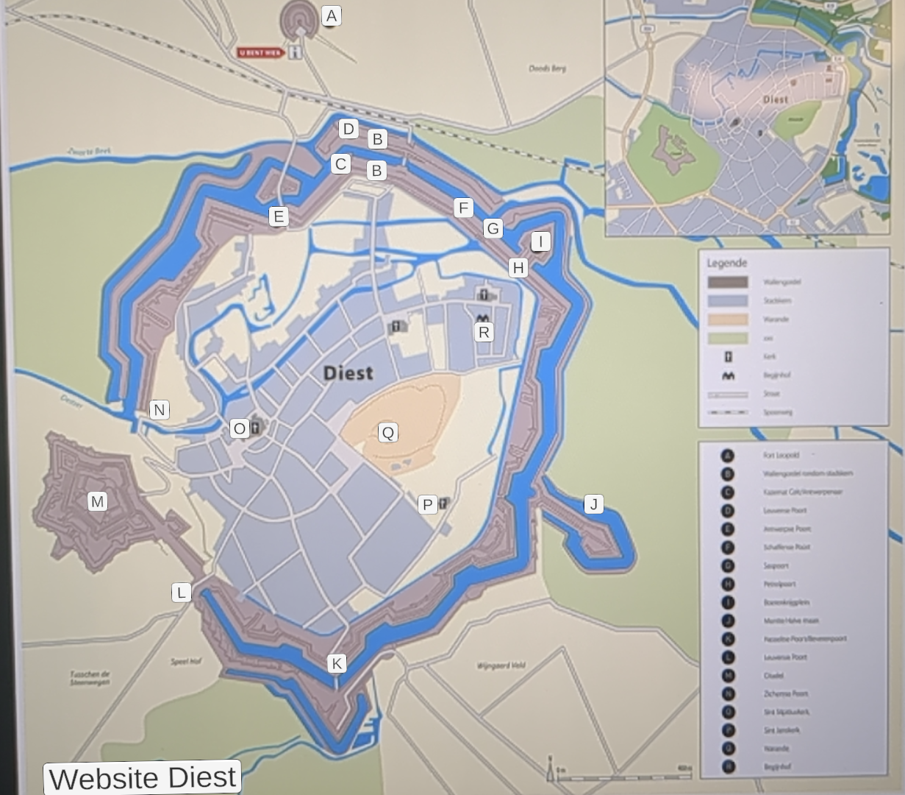
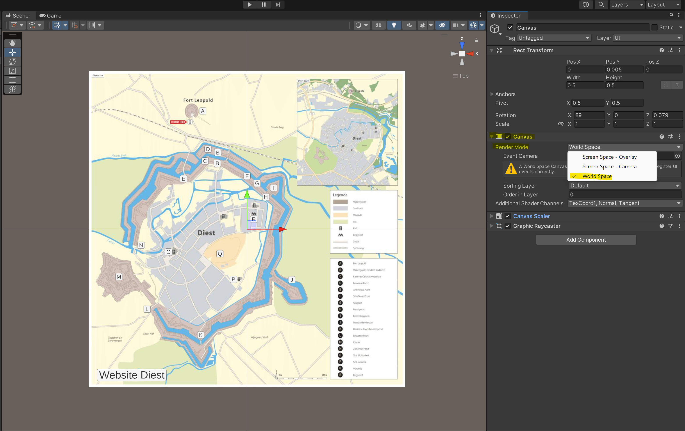
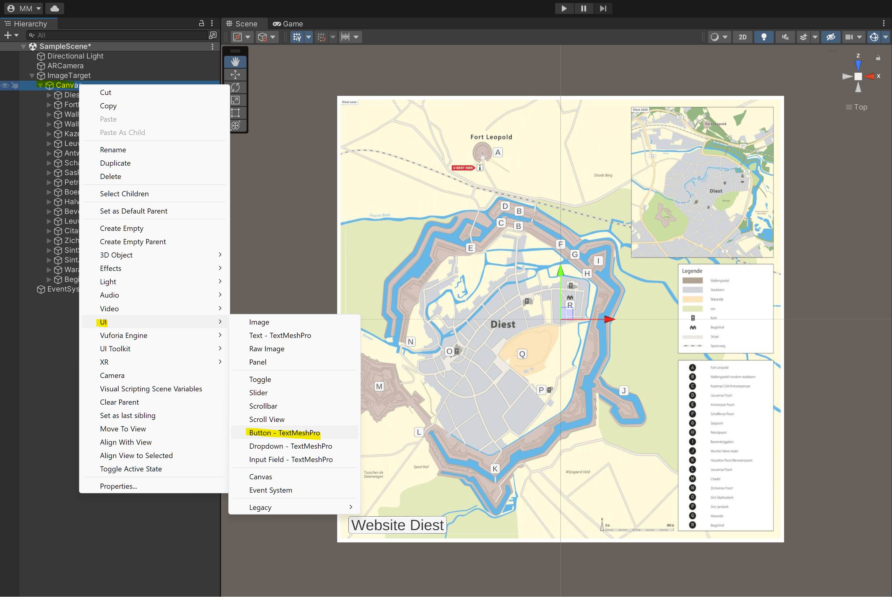
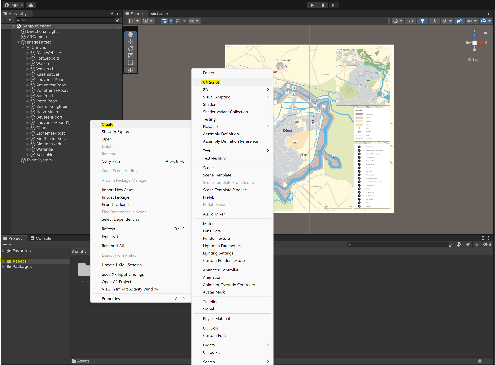
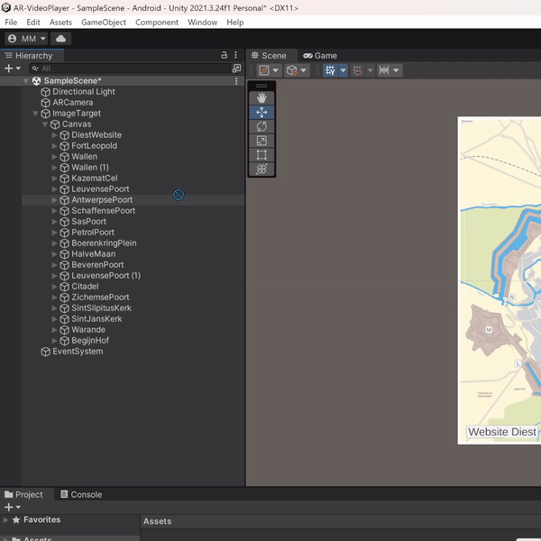
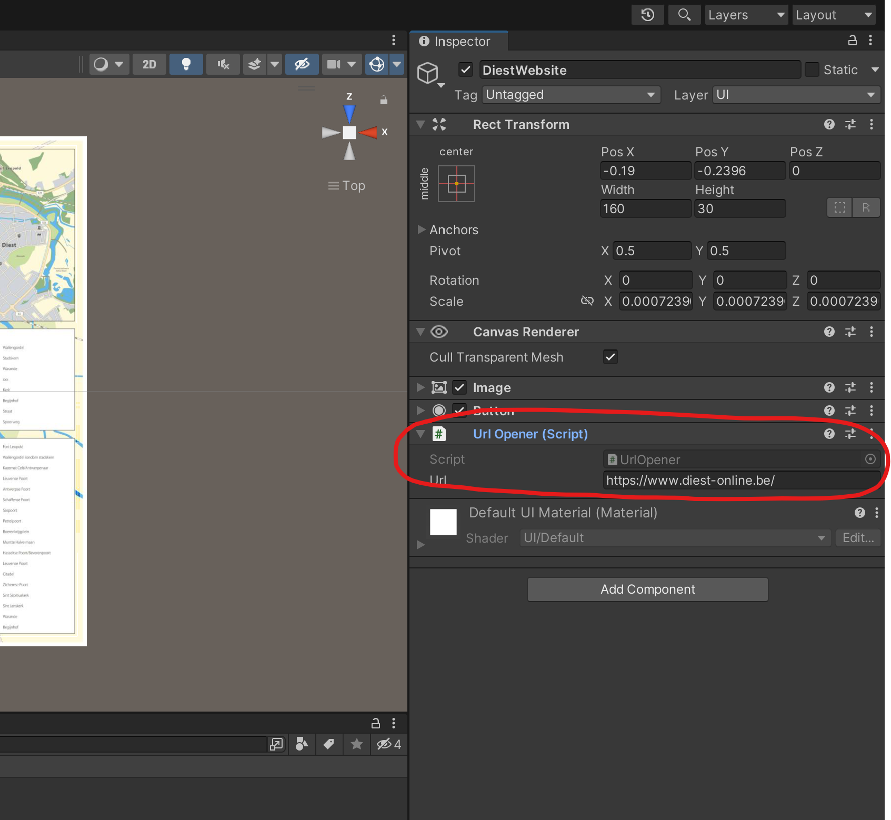
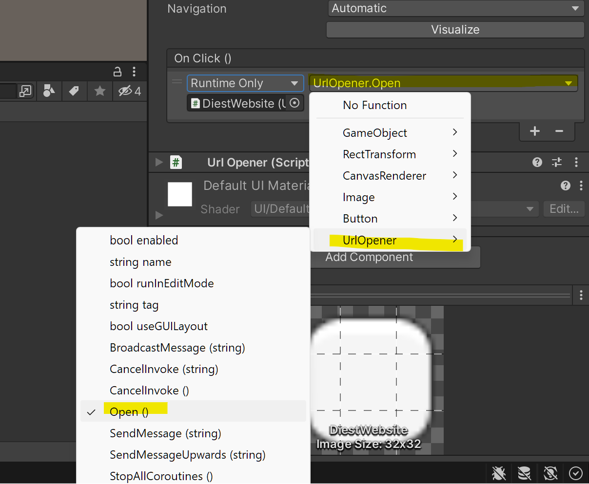

# Unity & Vuforia - Creating AR buttons with Url opener script

## Introduction
Welcome to the documentation for our Unity and Vuforia-based interactive AR map project. In the course of our development, we encountered a challenge related to the deprecation of an AR button component, leading us to devise an alternative solution. This documentation aims to provide insights into our workaround, ensuring a smooth transition for developers working on this project. Please follow the instructions below to implement the proposed solution effectively.

## Expected result
The expected result for this work around is a functioning image tracking AR application where the AR object is a clickable button with Url opener script to open any url of your choosing.



## Prerequisites
Before implementing the workaround for the deprecated AR button component, make sure your Unity project has the following components and functionalities already set up:
1. Unity Project Setup: Start with a functional Unity project, configured with the necessary settings for your target platform.
2. Vuforia Integration: Imported Vuforia SDK package, setting up a Vuforia license key, and configuring the Vuforia ARCamera.
3. Image tracking on one image: Implement basic image tracking using Vuforia. Confirm that your project can recognize and track images as intended.
4. Unity project configuration: Correct build settings for your platform

Ensure that these prerequisites are met before proceeding with the workaround for the deprecated AR button component. If any of these components are not yet implemented or configured, refer to the appropriate Unity and Vuforia documentation for guidance.

## Step-by-Step Solution Walkthrough
In this section, I will guide you through the solution step by step, using my project as a reference. It's important to note that this solution is versatile and can be applied across various AR applications where a button or object is required for opening links.

### Step 1: Canvas Creation
Start by creating a canvas, which will act as the foundation for the buttons or objects in your AR environment. This canvas not only provides a platform for these elements but also ensures their proper scaling relative to our image target.

**To create one of these canvases:** first select your imageTarget then right click and in the dropdown select UI -> canvas. 


Next you will want to scale and resize the canvas so that it fits well over the imageTarget, to do this look select the canvas and in the right hand side of the screen look at the properties. By default you'll see that you can't edit any of the canvas Rect Transform properties, this is because the canvas is still locked to the screen space but we want it to be a world space object so we can edit it. 

**To make this canvas a world space object:** Go the the canvas dropdown in the properties, open de Render Mode dropdown and select World Space. Now when you go back to the Rect Transform properties, you'll see these are no longer grayed out meaning you can now edit the dimensions and scale of this canvas to better fit your image target. Now try to make it so that the canvas is as close of a match to the image target as you an get. It does not have to be pixel perfect but it helps you with placing the buttons later.



## Step 2: Adding a button
Now the we have a canvas to work on, we can start creating a button. 

**To create a button:** select the canvas (so that we are in the correct layer), right click from the dropdown select UI -> Button - TextMeshPro. This will create a button with a editable text. After the button is created you can change its dimensions, scale, position, etc. so just do with the button what ever you want so that it's how you want it to look and at the place you want it to be.



## Step 3: Writing the OpenUrl Script
Now the we have our canvas with a (or multiple) button(s), we'll have to create a small script for actually opening a Url. This script is extremely easy and only takes up about 5 lines of code. 

**First, we have to create a script:** In the bottom of the screen where the assets folder is located, right click from the dropdown select create -> C# Script. This will create you a script and prompt you to give it a name, for this project I've named it **UrlOpener**



Now that the script is created, double click it to open it in the code editor. Once the script is opened, you can delete all the contents and copy this code into the file:
```C#
using UnityEngine;

/// <summary>
/// A script for opening a URL when triggered.
/// </summary>
public class UrlOpener : MonoBehaviour
{
    /// <summary>
    /// The URL to be opened.
    /// </summary>
    public string Url;

    /// <summary>
    /// Opens the specified URL.
    /// </summary>
    public void Open()
    {
        Application.OpenURL(Url);
    }
}
```
Once you've done this, you can save the code and close this script. That's all the code we need to write for this Url opener to work.

### Step 4: Enabling the buttons to open a Url
Now that you have created the script we have to add this script to our button so that our button can actually open a url.

**To do this:** simply grab the script from the assets folder and drag&drop this into the button. If you've done this correct you'll be able to to see a Url Opener (Script) section in the button properties. While here you can also already directly add the url you want to open with this button. Doing this is as simple as adding the url in the Url input field.

 

And just like that we are already on the final step and that is adding an On Click event to the button because of course we want our url to open when we have clicked on the button.

**To do this:** In the Button section of our button properties look for the On Click() menu. By default this menu is empty so we'll have to add an event. Select the + button and a new event will be created. The first thing you'll see is a drop down for Off, Editor and Runtime or Runtime Only, set this to Runtime Only. The second dropdown is where we'll select the UrlOpener script, from the drop down select UrlOpener -> Open()

 


## Conclusion

Congratulations! If you've followed the steps outlined in this documentation, you should now have a functional AR application with a clickable button that directs users to a URL of your choice. 

For adding more buttons, the process is straightforward. Simply duplicate the button created in this guide, rename it, and adjust the URL by modifying the Url property in the Url Opener script through the Unity Inspector. This flexibility allows you to easily expand the interactive elements in your AR experience.

Enjoy exploring the possibilities of your augmented reality application, and feel free to customize and enhance it further to suit your project's unique requirements.

*Created by Marnik Maes*


